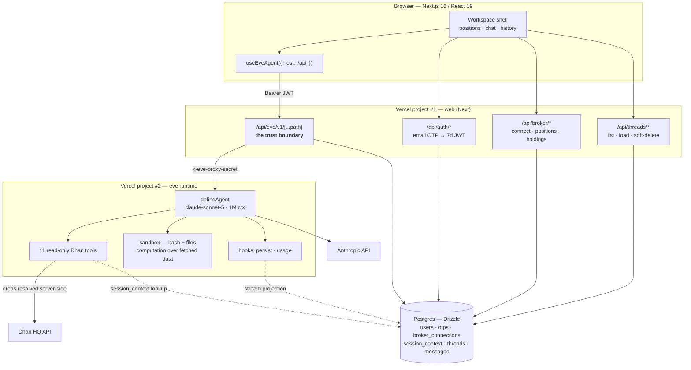
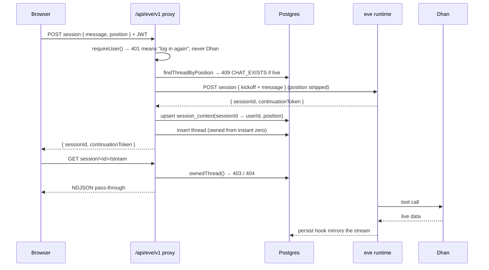
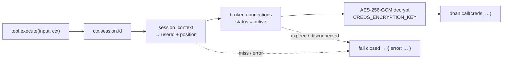
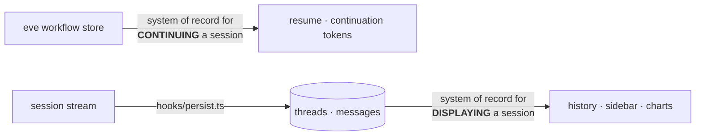

<div align="center">

# zap-eve-agent

**A read-only AI analyst for your live Dhan positions.**

Tap a position → talk to an agent that can see your P&L, candles, option chains,
funds, orders, and trades — and that *structurally cannot* place, modify, or
cancel a trade.

`Next.js 16` · `React 19` · `eve durable agents` · `claude-sonnet-5` · `Postgres + Drizzle` · `TypeScript 6`

</div>

---

## The one-paragraph version

Zap is a two-deployment, one-repo system. A **Next.js app** owns identity,
broker credentials, and conversation ownership. A separate **eve runtime**
owns the agent loop — a durable, resumable workflow that streams tokens and
tool calls. The browser never talks to the agent runtime and never holds a
broker credential: every model call is proxied through an app-owned route
that authenticates the user, enforces thread ownership, and injects the
server-held continuation token. Broker credentials are AES-256-GCM at rest and
resolve **inside the tool executor**, keyed by session id — so no secret ever
enters the model context, not even once.

---

## Architecture



### Why two deployments

The agent runtime is a long-lived streaming process with a different build
(`eve build`) and a different failure surface than a Next app. Splitting them
means the web tier can redeploy without dropping in-flight agent sessions, and
the runtime is reachable *only* by a party holding `EVE_PROXY_SECRET`.

| | build | entry | authenticates |
|---|---|---|---|
| `zap-eve-agent` (web) | `next build` | `app/` | user JWT (HS256, 7d) |
| `zap-eve-agent-runtime` | `eve build` | `agent/` | proxy secret → Vercel OIDC → localhost |

Auth on the runtime channel is an ordered chain (`agent/channels/eve.ts`):
constant-time proxy-secret compare, then `vercelOidc()` for the eve TUI, then
`localDev()` for `eve dev`. A browser presenting none of these is rejected.

---

## The proxy is the product

`app/api/eve/v1/[...path]/route.ts` is the most load-bearing file in the repo.
It exposes exactly three upstream routes and 404s everything else.



Five invariants it enforces:

1. **Zap 401 ≠ Dhan problem.** A 401 always and only means "log in again."
   An expired Dhan token is *broker status*, surfaced as a reconnect banner.
2. **Ownership on every session-scoped call** — 403 for a foreign thread,
   404 for an unknown one.
3. **Position never reaches the model as a parameter.** It's stripped from the
   body, written to `session_context`, and re-stated as a kickoff prose block.
4. **The server owns the continuation token.** Client-supplied tokens are
   discarded — eve routes by *token*, not URL, so a stale one would silently
   fork a new session instead of erroring. A mismatched `sessionId` in the
   response is treated as a fork and fails loudly with a 409.
5. **One live thread per position**, enforced both in the proxy and by a
   partial unique index in Postgres.

---

## How a tool gets credentials

This is the security core. The model never sees, passes, or names a credential.



`agent/lib/dhan/context.ts` **fails closed**: any lookup or decrypt failure
resolves to `null` rather than degrading to the env-var bench account. Tool
`execute` never throws — every failure returns an `{ error }` envelope the
model can reason about and relay in plain language.

Expired-token detection is deliberately paranoid: Dhan's Data API returns 401s
on *live* tokens (error 806), so a 401 only marks the connection
`token_expired` after a cheap `getFundLimit` probe also fails.

### The toolset

Eleven read-only specs in `agent/lib/dhan/specs.ts`, one thin file each in
`agent/tools/` (eve derives tool names from filenames):

`get_position_snapshot` · `get_positions` · `get_holdings` · `get_funds` ·
`get_order_book` · `get_trade_book` · `get_ltp` · `get_expiry_list` ·
`get_option_chain` · `get_intraday_candles` · `get_daily_candles`

There is **no write tool and no approval gate** — not because approvals were
skipped, but because no write path exists to gate. eve's stock `web_search`,
`web_fetch`, `todo`, and `load_skill` are explicitly `disableTool()`'d, so the
domain surface is exactly eleven reads. At eleven eager tools, deferred
tool-loading would cost more context than it saves — `agent/hooks/usage.ts`
logs per-step provider usage to NDJSON to keep that call honest with data
instead of vibes.

Derivative positions resolve their underlying automatically
(`agent/lib/dhan/underlying.ts`), so a NIFTY option chat can pull the index's
candles and option chain, not just the contract's.

### The sandbox — why the numbers are computed, not guessed

Alongside the domain reads, the agent keeps eve's **sandbox (bash + files)**.
This is the deliberate answer to the failure mode that makes most "AI analyst"
demos untrustworthy: an LLM asked to eyeball 300 candles and report a max
drawdown will produce a confident, plausible, *wrong* number.

So the analyst doesn't eyeball. `agent/instructions.md` directs it to reach for
real computation whenever computation earns its keep — levels, drawdowns,
rolling stats, P&L scenarios across an option chain — writing intermediate data
to files and returning only the conclusions:

```
get_daily_candles → 300 OHLC bars
      ↓ written to a file, not held in the context window
bash + python in the sandbox → swing highs/lows, ATR, max drawdown
      ↓
"₹412 below entry (−3.0%); worst peak-to-trough in the window was −11.4%"
```

Three things fall out of that:

- **Arithmetic is executed, not predicted.** A number in the answer traces to a
  process that ran, not to a token the model found likely.
- **The context window stays cheap.** Hundreds of bars live in a file; only the
  derived conclusion re-enters the prompt.
- **It stays read-only.** The sandbox is compute over data already fetched — it
  has no route to the user's broker account, which remains reachable only
  through the eleven read specs and their server-resolved credentials.

The instructions also draw the line in the other direction: don't shell out for
arithmetic you can do inline. The sandbox is for work that's genuinely too big
to do in your head — which is exactly the work models are worst at faking.

---

## Persistence: two systems of record, on purpose



`agent/hooks/persist.ts` projects the event stream into Postgres. It is
**observe-only and runs after each event is durably recorded**, so persistence
can lag but can never corrupt or block a turn. Every handler swallows its own
errors — a down database degrades history, not the agent.

Details worth stealing:

- **Turn assembly.** User rows insert once on `message.received`; the assistant
  row is *upserted* per turn (`messages_assistant_turn_uidx`, a partial unique
  index on `role = 'assistant'`) as fragments stream in — a crash loses at most
  one unflushed fragment.
- **Token de-doubling.** The hook context namespaces continuation tokens as
  `eve:eve:<uuid>` while the HTTP API expects `eve:<uuid>`. Sending the doubled
  form doesn't error — it silently forks a new session. So a repeated leading
  segment is stripped before storage.
- **Owner backfill.** The hook may create a thread before the proxy has written
  `session_context`; ownerless rows are never listed and get backfilled.
- **Cost.** `usage` is priced server-side against a price table into a `cost`
  JSONB column per message.
- **Resume cursor.** Every stream event bumps `threads.stream_index`, which
  `useEveAgent` uses to reattach mid-turn.

Chat history reloads render from the same JSON the live stream produced, which
is why `components/charts/tool-result-chart.tsx` can draw candlesticks and
option-chain OI charts identically in both paths.

---

## Repository map

```
agent/                     the eve runtime
  agent.ts                 defineAgent — claude-sonnet-5, 1M context window
  instructions.md          identity · tool policy · style · stated limitations
  channels/eve.ts          proxy-secret → OIDC → localDev auth chain
  hooks/persist.ts         stream → Postgres projection (observe-only)
  hooks/usage.ts           per-step token accounting → NDJSON
  tools/*.ts               11 read-only tools + 4 explicit disableTool()s
                           (eve's bash/files sandbox stays on — see below)
  lib/dhan/                client · specs · per-session context · underlying
  lib/db/                  drizzle schema · crypto · mirror · pricing

app/                       Next.js 16 App Router
  api/eve/v1/[...path]/    the proxy — auth, ownership, tokens, kickoff
  api/auth · broker · threads
  _components/             workspace shell, positions, chat, broker modal

components/
  ai-elements/             streaming message, reasoning, tool cards
  charts/                  lightweight-charts candles + option-chain OI
  ui/                      radix + tailwind v4 primitives

lib/                       client SDK + server auth/otp/threads helpers
drizzle/                   generated migrations
scripts/                   deploy-runtime.sh · deploy-web.sh · db-smoke.ts
docs/plan-v1-zap-eve.md    decisions, phases, verification status
```

---

## Security model at a glance

| Asset | Protection |
|---|---|
| Dhan access token | AES-256-GCM (`CREDS_ENCRYPTION_KEY`), decrypted only in the tool executor and broker routes |
| Login codes | HMAC-SHA256 of `code:email` with `CREDS_HASH_PEPPER` — raw codes never stored |
| Session | HS256 JWT, 7 days, `AUTH_JWT_SECRET`; the only thing the browser holds |
| Agent runtime | `EVE_PROXY_SECRET`, compared with `timingSafeEqual` |
| Model context | Receives position *identity* and tool results only — never a credential |
| Write access | None. There is no order-placing code path in the repo. |
| Sandbox | Compute-only, over data already fetched — no route to the broker account |

Rotating `CREDS_ENCRYPTION_KEY` invalidates every stored broker credential —
pin it per environment.

---

## Run it locally

```bash
nvm use 24                    # eve requires Node >= 24
docker compose up -d          # Postgres on :5438
cp .env.example .env          # openssl rand -hex 32 for each secret + ANTHROPIC_API_KEY
npm install
npm run db:migrate            # drizzle-kit migrate
npm run dev                   # Next + eve on :3000 (withEve mounts both)
```

Log in with `test@zaptrade.app` / OTP `123456`, or any email — codes print to
the server console until `RESEND_API_KEY` is set. Connect Dhan with your client
ID and a fresh access token (24h life; the app shows a reconnect banner when it
dies).

```bash
npm run typecheck     # tsc --noEmit
npm run db:smoke      # end-to-end DB sanity
npm run dev:eve       # runtime alone (bench mode, DHAN_* env credentials)
```

## Deploy

```bash
./scripts/deploy-runtime.sh   # → zap-eve-agent-runtime  (eve build)
./scripts/deploy-web.sh       # → zap-eve-agent          (next build)
```

The runtime needs `ANTHROPIC_API_KEY`, `DATABASE_URL`, `CREDS_*`, and
`EVE_PROXY_SECRET`. The web project needs the same set plus
`EVE_UPSTREAM_ORIGIN` pointing at the runtime deployment. Locally that variable
is unset and `withEve` serves the runtime on the same origin — the proxy code
path is identical either way.

---

<div align="center">
<sub>Design decisions, phase log, and verification status live in <code>docs/plan-v1-zap-eve.md</code>.</sub>
</div>
