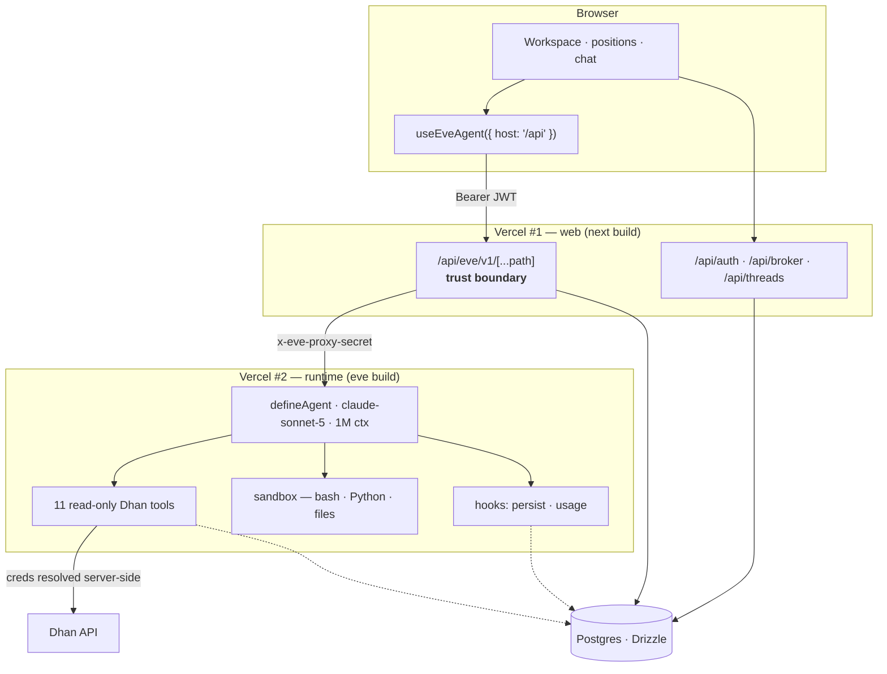
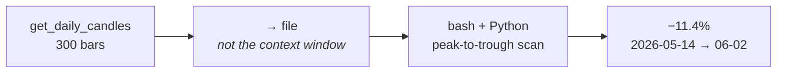
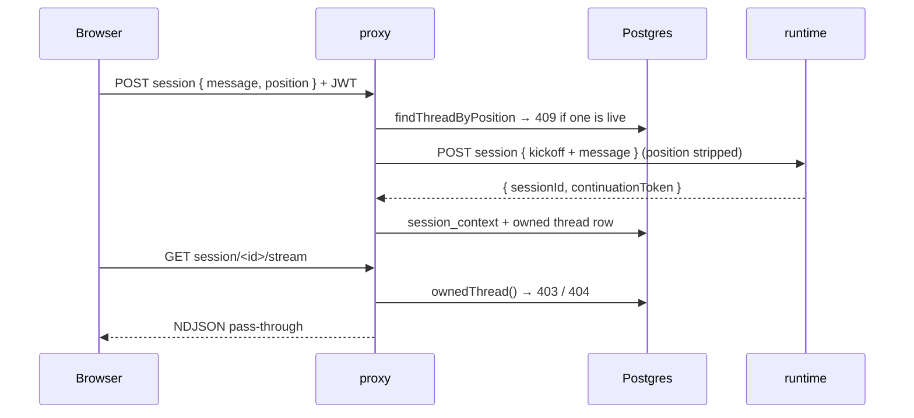
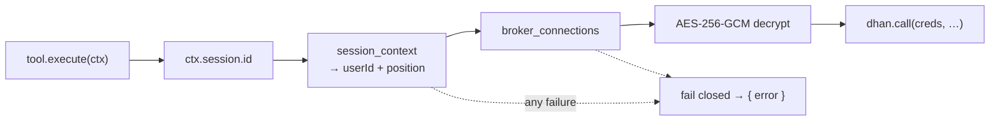

<div align="center">

# zap-eve-agent

**A read-only AI analyst for your live Dhan positions.**

Tap a position, ask about it. The agent reads your P&L, candles, option chains,
funds and orders — computes the numbers in bash and Python rather than guessing
them, and *structurally cannot* place, modify, or cancel a trade.

`Next.js 16` · `React 19` · `eve` · `claude-sonnet-5` · `sandboxed bash + Python` · `Postgres + Drizzle`

</div>

---

## Shape of the system

One repo, two deployments. A **Next.js app** owns identity, broker credentials,
and thread ownership. A separate **eve runtime** owns the agent loop — durable,
resumable, streaming. The browser never reaches the runtime and never holds a
broker credential.



Splitting the tiers lets the web app redeploy without dropping in-flight agent
sessions, and leaves the runtime reachable only by a holder of
`EVE_PROXY_SECRET`. Its auth is an ordered chain (`agent/channels/eve.ts`):
constant-time secret compare → `vercelOidc()` for the eve TUI → `localDev()`.

---

## It opens a notebook instead of eyeballing the chart

Ask a model to scan 300 OHLC bars for a max drawdown and it returns something
fluent, specific, and fabricated — a plausible number is indistinguishable from
a correct one. The fix isn't a better prompt; it's to stop asking the model to
be the calculator.

So the agent gets a sandbox: **bash, Python, a filesystem**. Read tools fetch,
code computes, the model explains.



Three consequences: figures trace to a process that ran, not a likely token;
bars live in a file so the context stays cheap; wrong code *fails visibly*
instead of returning a beautiful lie. `agent/instructions.md` also draws the
line — no shelling out for arithmetic doable inline.

The sandbox computes over data already fetched. No credentials, no broker
network path, no write route.

---

## The proxy

`app/api/eve/v1/[...path]/route.ts` exposes three upstream routes and 404s the
rest.



1. **A Zap 401 only ever means "log in again."** An expired Dhan token is
   broker status, surfaced as a reconnect banner.
2. **Ownership checked on every session-scoped call.**
3. **Position never reaches the model as a parameter** — stripped, stored in
   `session_context`, restated as a kickoff prose block.
4. **The server owns the continuation token.** eve routes by token, not URL, so
   a stale client token would silently fork a session; a mismatched `sessionId`
   in the reply is treated as a fork and 409s.
5. **One live thread per position** — enforced in the proxy *and* by a partial
   unique index.

---

## Credentials never enter the model context



`agent/lib/dhan/context.ts` fails closed — a lookup or decrypt failure resolves
to `null` rather than degrading to the env bench account. `execute` never
throws; failures return `{ error }` envelopes the model can relay.

Expiry detection is deliberately paranoid: Dhan's Data API returns 401s on live
tokens (error 806), so a 401 marks the connection `token_expired` only after a
cheap `getFundLimit` probe also fails.

### Tools

Eleven read-only specs (`agent/lib/dhan/specs.ts`), one file each in
`agent/tools/` — eve derives names from filenames:

`get_position_snapshot` · `get_positions` · `get_holdings` · `get_funds` ·
`get_order_book` · `get_trade_book` · `get_ltp` · `get_expiry_list` ·
`get_option_chain` · `get_intraday_candles` · `get_daily_candles`

No write tool, no approval gate — there's no write path to gate. eve's stock
`web_search`, `web_fetch`, `todo`, and `load_skill` are `disableTool()`'d. At
eleven eager tools, deferred loading would cost more context than it saves;
`agent/hooks/usage.ts` logs per-step usage to NDJSON to keep that honest.
Derivative positions resolve their underlying automatically, so a NIFTY option
chat can pull the index's chain and candles.

---

## Persistence: two systems of record

eve's workflow store is authoritative for **continuing** a session. Postgres is
authoritative for **displaying** one: `agent/hooks/persist.ts` projects the
event stream into `threads`/`messages`. It's observe-only and runs after each
event is durably recorded, so history can lag but never blocks or corrupts a
turn — every handler swallows its own errors.

- **Turn assembly** — user rows insert once; the assistant row upserts per turn
  (`messages_assistant_turn_uidx`, partial unique on `role = 'assistant'`), so a
  crash loses at most one unflushed fragment.
- **Token de-doubling** — hook context yields `eve:eve:<uuid>` where the API
  wants `eve:<uuid>`. The doubled form doesn't error, it silently forks.
- **Owner backfill** — the hook may create a thread before the proxy writes
  `session_context`; ownerless rows are never listed.
- **Cost** — usage priced server-side into a `cost` JSONB per message.
- **Resume cursor** — every event bumps `threads.stream_index`.

History renders from the same JSON the live stream produced, so
`components/charts/` draws candles and option-chain OI identically in both.

---

## Map

```
agent/            agent.ts · instructions.md · channels/ · hooks/
  tools/          11 read-only tools + 4 disableTool()s (sandbox stays on)
  lib/dhan/       client · specs · per-session context · underlying
  lib/db/         drizzle schema · crypto · mirror · pricing
app/              App Router — api/eve/v1 proxy, auth, broker, threads
components/       ai-elements (streaming) · charts · radix + tailwind v4
lib/              client SDK, server auth/otp/threads
drizzle/          migrations          scripts/  deploy + db smoke
docs/plan-v1-zap-eve.md               decisions, phases, verification
```

| Asset | Protection |
|---|---|
| Dhan token | AES-256-GCM, decrypted only in the tool executor and broker routes |
| Login codes | HMAC-SHA256 of `code:email` — raw codes never stored |
| Session | HS256 JWT, 7d; the only thing the browser holds |
| Runtime | `EVE_PROXY_SECRET`, `timingSafeEqual` |
| Write access | None. No order-placing path exists in the repo. |

Rotating `CREDS_ENCRYPTION_KEY` invalidates stored broker credentials — pin it
per environment.

---

## Run it

```bash
nvm use 24                    # eve requires Node >= 24
docker compose up -d          # Postgres on :5438
cp .env.example .env          # openssl rand -hex 32 per secret + ANTHROPIC_API_KEY
npm install && npm run db:migrate
npm run dev                   # Next + eve on :3000
```

Log in with `test@zaptrade.app` / `123456`, or any email — codes print to the
console until `RESEND_API_KEY` is set. Connect Dhan with a client ID and fresh
access token (24h life).

`npm run typecheck` · `npm run db:smoke` · `npm run dev:eve` (runtime alone,
bench credentials)

```bash
./scripts/deploy-runtime.sh   # → zap-eve-agent-runtime
./scripts/deploy-web.sh       # → zap-eve-agent
```

Both need `ANTHROPIC_API_KEY`, `DATABASE_URL`, `CREDS_*`, `EVE_PROXY_SECRET`;
web additionally needs `EVE_UPSTREAM_ORIGIN`. Unset locally, `withEve` serves
the runtime on the same origin — the proxy path is identical either way.
